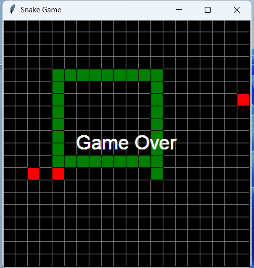
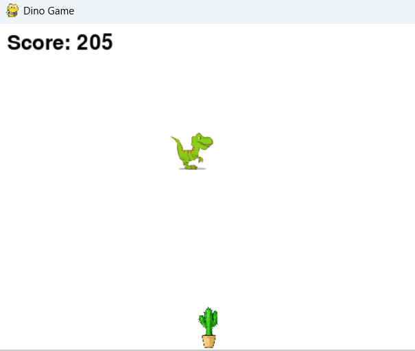

28.03.25
Что изменено:
Змейка теперь анализирует положение ближайшей еды (self.food[0]) 
и выбирает направление движения (self.direction), чтобы приблизиться к ней.
Логика движения осталась прежней, но теперь направление определяется автоматически.

Ограничения:
Это простая реализация, которая не учитывает препятствия (например, тело змейки). 
Для более сложного поведения можно использовать алгоритмы поиска пути, такие как A* или BFS.

